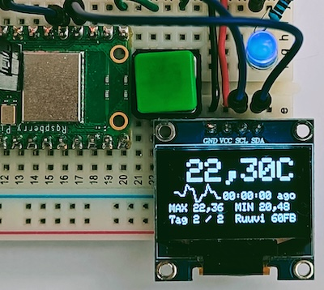
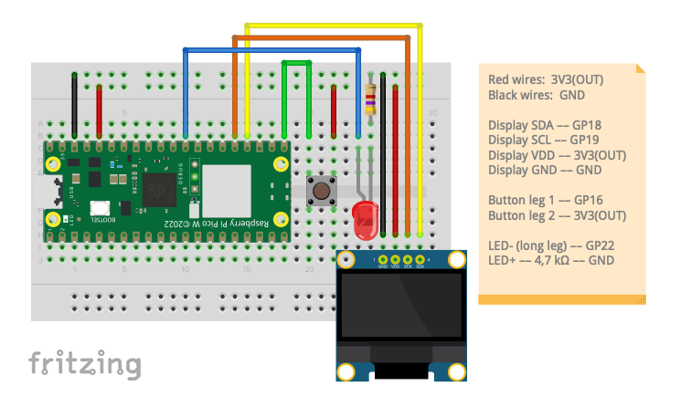

# Remote Display For RuuviTag Environment Sensor With Raspberry Pi Pico W

The project makes use of a [Raspberry Pi Pico W](https://www.raspberrypi.com/products/raspberry-pi-pico/) and an SSD1306 OLED display to show nearby [RuuviTag](https://ruuvi.com) sensor data via Bluetooth LE broadcasts. A button press cycles through found tags. The LED flashes on successful tag read.

The project can be simplified by only attaching the display, in which case it just keeps showing the tag it finds first.

A UF2 file ready to be dropped into Pico: [pico-ruuvi-station.uf2](pico-ruuvi-station.uf2)

A detail shot of the running prototype:

## Prototype setup (Fritzing)

The image shows the default setup, pins can be adjusted in `main.c`.

## Features

* Automatically finds and starts collecting measurements from nearby tags, identified by the last four chars in their MAC address
* Can collect up to 9 (by default) tags' measurements
* Received data is stored in memory which is lost on power down
* Display:
    * Latest received temperature measurement, including how long ago it was
    * Min and max measurements for a tag
    * A small [sparkline graph](https://github.com/tapiocode/sparkline) is drawn showing the trend of change over the latests measurements of a tag
* In case of multiple tags, the button press cycles through them in order of discovery
* The LED flashes when a tag transmission has been successfully received

## Build configuration

The amount of allowed tags can be set in `ruuvitag_reader/ruuvitag_reader.c`:

    // Default value:
    #define RUUVITAGS_MAX_AMOUNT 9

To enable some debug printing to serial port, add `#define PRINTF_DEBUG` to the source file you want to debug:

## Running Pico on battery power

Note: this information applies to any Pico project.

The Pico can be powered with a USB cable while prototyping, but for better portability a battery pack can be used instead. Three 1.5V AA batteries in series can be used, which provide about 4.5 V, which is within the range of 1.8V to 5.5V that the Pico requires.

The battery pack is connected to the Pico’s VSYS (pin 39) and its ground.

Read more: [Powering your Pico](https://projects.raspberrypi.org/en/projects/introduction-to-the-pico/12)

# License

MIT
